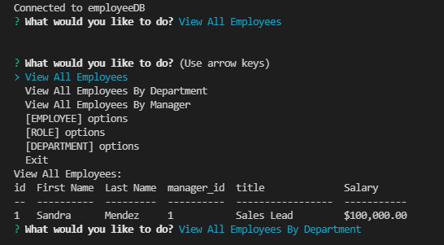

  # Employee Tracker

  
  
  ## Description
  An application to keep trafk of employees, roles, and departments. Can assign, delete, and view all the roles. Updates to MySQL database.
  ## Table of Contents 
  
  - [Installation](#installation)
  - [Usage](#usage)
  - [License](#license)
  - [Questions](#questions)
  
  ## Installation
  - To install, click the green code button. Download the zip file and unpack. Open in your favourite code editor.
  - Open index.js and open the terminal
  - Change mysql database password to your password
  - In the terminal run "npm i"
  - In the termianl run "npm start"
  - Follow the onscreen prompts

  ## Usage
  [DEMO VIDEO](https://drive.google.com/file/d/1Ya53p_eJriCaKdG61gCGHrIj4pYs4umW/view).

  
  
  
  ## License
  [APACHE](https://www.apache.org/licenses/LICENSE-2.0.txt)
  
  ## Questions
  
  [GitHub Profile](https://github.com/bdubz93).
  
  Questions? You can email me at brandonwinkler@live.ca.